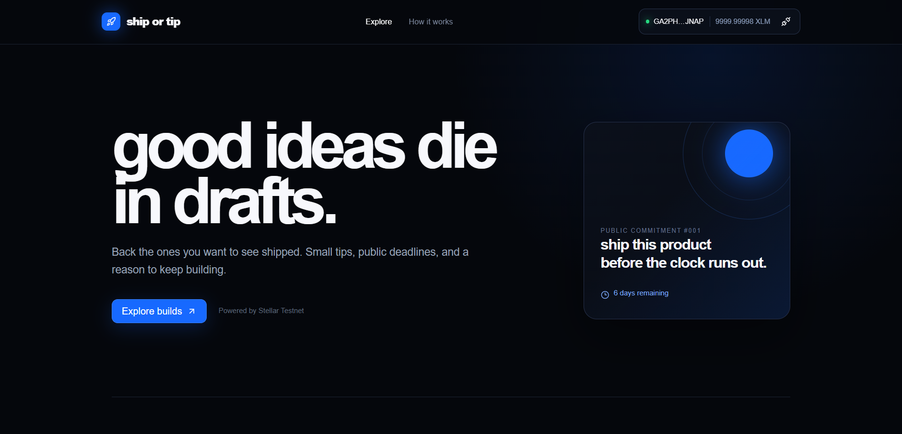
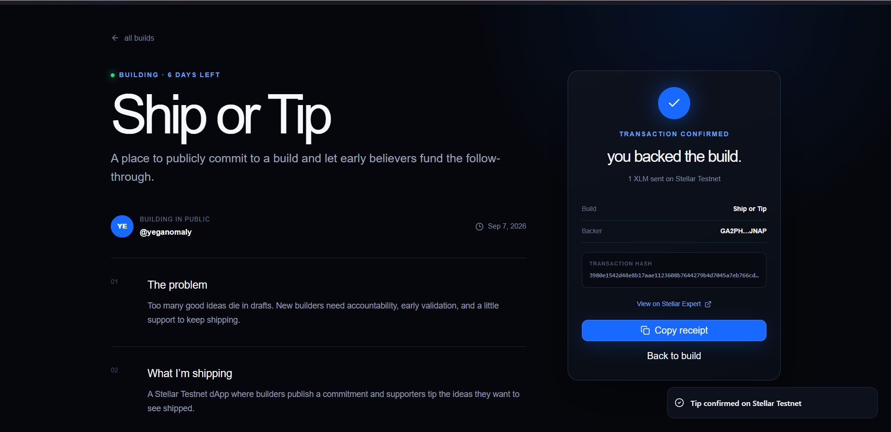

# Ship or Tip

A Stellar Testnet dApp for public build commitments. Builders share what they plan to ship and supporters can back the ideas they want to see completed with small XLM tips.

## Live Demo

[Open Ship or Tip](https://ship-or-tip.vercel.app)

## The Idea

Good ideas often disappear inside drafts. Ship or Tip gives builders a lightweight way to publish an idea, set a deadline, explain what they are building, and receive early support from people who want to see it shipped.

The current White Belt release demonstrates the complete Stellar payment flow on Testnet.

## Yellow Belt Upgrade

Ship or Tip is being upgraded into a contract-backed multi-wallet dApp:

- Multi-wallet connection through Stellar Wallets Kit
- Freighter Mobile support through WalletConnect
- Rust/Soroban tipping contract deployed on Testnet
- Contract-backed XLM transfers and onchain build statistics
- Visible preparing, signature, pending, success, and failure states
- Typed `TipReceived` events for live synchronization

Contract ID: `CB2EJPMDG26BXUQO46BII5DZCX6OJMEKFTCY6LYYWVVBLXLXSFSPG6K7`

[View the verified contract tip](https://stellar.expert/explorer/testnet/tx/d5a0be50c47deedf938c4e5b24b68288872c980ec0fc5752f937b257349470c3)

## White Belt Features

- Connect and disconnect Freighter Mobile through WalletConnect v2
- Restore an approved wallet session
- Read and display the connected account's Testnet XLM balance
- Browse three independent public build commitments
- Select a suggested or custom XLM tip amount
- Build, sign, and submit an XLM payment on Stellar Testnet
- Display loading, rejection, failure, and success feedback
- Show the confirmed transaction hash
- Link the receipt to Stellar Expert
- Copy a shareable transaction receipt
- Responsive desktop and mobile interface

## Stellar Integration

- Network: Stellar Testnet
- Wallet: Freighter Mobile
- Connection protocol: WalletConnect v2
- Horizon endpoint: `https://horizon-testnet.stellar.org`
- Explorer: Stellar Expert Testnet
- Demo recipient: `GA2PHFIXHVIAGCI4WJVZSN7CS7KT52HRB25CG6IWR4QHKWLTOYUFJNAP`

All assets and transactions in this project are for testing only and have no real-world value.

## Tech Stack

- Next.js 16
- React 19
- TypeScript
- Stellar SDK
- Freighter Mobile
- WalletConnect Universal Provider
- Reown AppKit
- Tailwind CSS
- Radix UI
- Sonner

## Run Locally

### Prerequisites

- Node.js 22 or newer
- Freighter Mobile configured for Stellar Testnet
- A WalletConnect/Reown Project ID

### Installation

```bash
git clone https://github.com/yeganomaly/ship-or-tip.git
cd ship-or-tip
npm install
npm run dev
```

Open `http://localhost:3000` in your browser.

The public WalletConnect Project ID used by the demo is included in the client code. For a fork or production deployment, replace it with your own Project ID from the Reown Dashboard.

## Test the Payment Flow

1. Open Ship or Tip.
2. Select a build.
3. Click **Connect wallet**.
4. Scan the QR code with Freighter Mobile or use the mobile deep link.
5. Approve the Testnet connection.
6. Confirm that the XLM balance appears in the header.
7. Choose a tip amount.
8. Approve the transaction in Freighter.
9. Check the success receipt and transaction hash.

## Wallet Connection and Balance

The connected Freighter wallet address and live Testnet XLM balance are displayed clearly in the header.



## Verified Testnet Transaction

A successful 1 XLM tip was signed with Freighter Mobile and confirmed on Stellar Testnet.



- Amount: `1 XLM`
- Status: `Confirmed`
- Transaction hash: `3980e1542d48e8b17aae1123608b7644279b4d7045a7eb766cd3e60ad959b982`
- [View transaction on Stellar Expert](https://stellar.expert/explorer/testnet/tx/3980e1542d48e8b17aae1123608b7644279b4d7045a7eb766cd3e60ad959b982)

## Safety

- Testnet only
- Never paste a secret key or recovery phrase into the website
- Freighter handles transaction approval and signing
- A supporter should always review the destination and amount before approving

## Builder

Built by [@yeganomaly](https://github.com/yeganomaly) for the Stellar Journey to Mastery — White Belt challenge.
